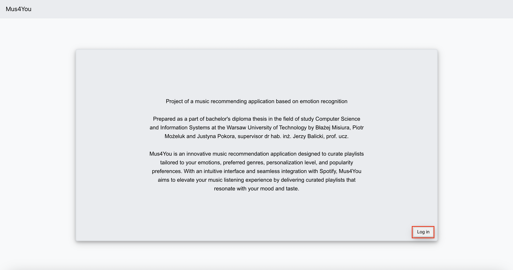

# Project of a music recommending application based on emotion recognition

This project aims to develop a web application that recommends music based on emotion recognition from images. The emotion recognition part was implemented with the use of models of deep learning and the dataset, which consists of images from FER2013, KDEF and AffectNet. Models were trained to recognise seven different emotions: anger, disgust, fear, happiness, sadness, surprise and neutrality. The music recommendation part involved integrating the application with the Spotify streaming service and developing a music recommendation algorithm. The application was implemented using the React framework and Python Django framework.
## Table of content
- [Requirement](#Requirement)
- [Installation](#Installation)
- [Manual](#Manual)
- [Credits](#Credits)
## Requirement

Python 3.9, Node.js 20.10.0, Spotify Premium account, \
Requirements for the backend are written in the file backend/requirement.txt \
Requirements for the frontend are written in the file frontend/package.json

## Installation
#### Train the model:
This part is optional since models are already trained. To train the model one needs to open the file "model/ResNet50_based-model_training_validation" or "model/CNN_model_training_validation", change the path to the dataset, and run the whole Jupiter notebook.

#### Install the dependencies:
```sh
cd  ./front-end
npm install

cd ./backend
pip3 install -r requirements.txt
```
#### Starting application:
For the application to work, the frontend and backend must operate simultaneously.
```sh
frontend:
cd  ./front-end
npm start

backend:
cd ./backend
py manage.py makemigrations
py manage.py migrate
py manage.py runserver
```

Additionally, in order for the user to be able to use the part of the application
related to music recommendation, it is necessary to add the user once to the application
user database on the Spotify API development website. This is a requirement imposed
by Spotify. After completing these steps, the application should be fully functional.

#### Testing:
Frontend:\
In order to
perform all tests, it is also necessary to run the backend server. Backend tests are run by
```sh
cd ./front-end
npm run test
```
Backend:
```sh
cd ./backend
py manage.py test
```
Additionally, it is necessary to manually enter the data used to interact with
Spotify API in the ”test data.yml” file where detailed instructions are located in the
”/backend/spotify” folder.

## Manual
### Getting started
#### Step 1
To get access to music recommendations you need to go to the home page and click on the login button.

#### Step 2
You will be redirected to the Spotify web page where you have to enter your credential
and log in.

#### Step 3
After logging in, you will be redirected to the home page where you now have a 'Music recommendation'  button which will redirect you to the page where you can create and play your personalized playlist.

### Music Recommendation
Before creating the playlist you have to input the required data on the left side.
#### Step 1 Emotion recognition
Choose the way of sending an image by clicking on 'Web cam' 'Upload image' (from your device)


If you chose the webcam option please aim the camera at a face and click 'Take photo'. After that, you can always retake it using the 'Retake button'.
If you choose to upload an image please click the 'Choose file' button and select a picture and click open. Then click the 'Predict emotion' button to get the predicted emotion. If you want to change it click on the 'Reupload image' button.
#### Step 2 Parameters selection
Select parameters by clicking on 'Popularity', 'Personalization', 'Genres' from the drop-down menu and select desired values.

#### Step 3 Create a playlist
If you did every step correctly you should now be able to click on the 'Recommended music' button to get a personalized playlist.

#### Step 4 Saving the personalized playlist
After creating a playlist there is the possibility to save it on your Spotify account by clicking the 'Save playlist' button which is situated next to the 'Recommend music' button
### Music player
On the right side, there is the music player marked with a blue border. You can control
the player using buttons and change the volume using the slider next to the buttons,
marked in red.


## Credits
[Błażej Misiura](https://github.com/blazej-misiura)\
[Piotr Możeluk](https://github.com/ananasek727)\
[Justyna Pokora](https://github.com/justynapokora)
